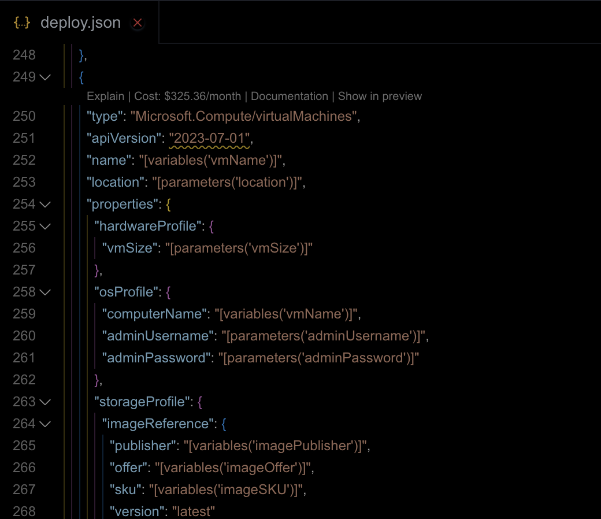

# Getting Started with Cloudeval

**From Sign-Up to Your First Diagram in 5 Minutes**

This guide will walk you through setting up Cloudeval and generating your first infrastructure diagram from Azure ARM templates or Bicep files. By the end, you'll have a working visualization of your infrastructure.

## Prerequisites

Before you begin, make sure you have:

- Azure ARM templates or Bicep files
- A modern web browser (Chrome, Firefox, Safari, or Edge)
- Basic understanding of Azure infrastructure concepts
- (Optional) Azure account for cloud import (Coming Soon)

## Step 1: Sign Up

1. Visit [cloudeval.ai](https://cloudeval.ai)
2. Click **"Sign Up"** in the top right corner
3. Enter your email address and create a password
4. Verify your email address (check your inbox)
5. Log in to your dashboard

**Tip:** You can also sign up with GitHub or Google for faster onboarding.

## Step 2: Try the Playground

**New to Cloudeval?** Try our interactive playground to explore features without signing up:

**[Launch Playground →](https://cloudeval.ai/playground)**

The playground lets you:

- Explore sample infrastructure diagrams
- Try the AI chat assistant
- Test diagram features
- See Cloudeval in action

**Tip:** Use the playground to get familiar with Cloudeval before working with your own infrastructure.

## Step 3: Create Your First Project

1. Click **"New Project"** in the dashboard
2. Enter a project name (e.g., "Production Infrastructure")
3. Choose your input method:

=== "Infrastructure as Code (Recommended)"

    ### Upload ARM Template or Bicep File

    

    1. Click **"Upload File"** or drag and drop
    2. Select your ARM template (`.json`) or Bicep file (`.bicep`)
    3. Cloudeval automatically parses the file
    4. Resources are discovered and mapped

    **Supported Formats:**
    - Azure ARM Templates (JSON)
    - Azure Bicep files
    - Multiple files (for modular templates)

    **Example:**
    ```bash
    # Upload your template
    az deployment group create \
      --resource-group my-rg \
      --template-file main.bicep \
      --parameters @parameters.json
    ```

    Then upload `main.bicep` to Cloudeval!

=== "Cloud Import (Coming Soon)"

    ### Connect Azure Account

    ::: warning Coming Soon
    Direct cloud account connection is coming soon! For now, use Infrastructure as Code files.
    :::

    **Planned Features:**
    - Connect Azure subscription
    - Automatic resource discovery
    - Real-time synchronization
    - Multi-subscription support

    **[Join our waitlist](https://cloudeval.ai/waitlist)** to be notified when this feature launches.

4. Click **"Create Project"**

## Step 4: Generate Your First Diagram

Once your project is created, Cloudeval will automatically:

1. **Parse Infrastructure Code** - Analyze your ARM/Bicep templates
2. **Map Resources** - Identify all Azure resources
3. **Detect Relationships** - Find dependencies and connections
4. **Generate Diagram** - Create an interactive visualization

**This typically takes 10-30 seconds depending on template complexity.**

<video controls style="min-width: 600px; max-width: 100%; height: auto; display: block; margin: 1.5rem auto;">
  <source src="../assets/videos/automated-diagrams.webm" type="video/webm">
  Your browser does not support the video tag.
</video>

## Step 5: Explore Your Diagram

Your diagram is now ready! Here's what you can do:

### Navigate the Diagram

- **Pan:** Click and drag the canvas
- **Zoom:** Use mouse wheel or pinch gesture
- **Select:** Click on any resource to see details
- **Search:** Use the search bar (Ctrl+K) to find specific resources

### View Resource Details

Click on any resource node to see:

- Resource properties from your template
- Parameters and variables
- Dependencies on other resources
- Output values

### Use the AI Chat

1. Click the **chat icon** in the bottom right
2. Try these questions:
   - "Show me all storage accounts"
   - "What resources depend on this virtual network?"
   - "Explain the network topology"
   - "Find resources without tags"

## Step 6: Edit Your Infrastructure

cloudeval includes a web-based editor for your Infrastructure as Code:

<video controls style="min-width: 600px; max-width: 100%; height: auto; display: block; margin: 1.5rem auto;">
  <source src="../assets/videos/web-editor.webm" type="video/webm">
  Your browser does not support the video tag.
</video>

1. Click **"Code Editor"** tab
2. View your ARM template or Bicep file
3. Make edits with syntax highlighting
4. See changes reflected in the diagram
5. Export updated files

**Features:**

- Syntax highlighting
- Auto-completion
- Error detection
- Format validation
- Multi-file support

## First Win Checklist

- **Account created and verified**
- **Tried the playground**
- **First project created**
- **Infrastructure file uploaded**
- **Diagram generated successfully**
- **Explored the interactive diagram**
- **Asked a question in AI chat**
- **Edited infrastructure code**

**Congratulations!** You've successfully set up Cloudeval and generated your first infrastructure diagram.

## Next Steps

Now that you have the basics, explore these features:

1. **[Work with ARM Templates](../tutorials/arm-templates.md)** - Deep dive into ARM template visualization
2. **[Use Bicep Files](../tutorials/bicep-files.md)** - Visualize Bicep infrastructure
3. **[Customize Your Diagram](../tutorials/customize-diagrams.md)** - Adjust layouts and styling
4. **[Export Your Diagram](../features/export.md)** - Share with your team
5. **[Use AI Chat](../tutorials/ai-chat-basics.md)** - Master the AI assistant
6. **[Collaborate with Team](../features/collaboration.md)** - Invite team members

## Common Issues

### Template Parsing Fails

**Problem:** Can't parse ARM template or Bicep file

**Solutions:**

- Verify file is valid JSON (for ARM) or valid Bicep syntax
- Check for syntax errors
- Ensure all required parameters are provided
- Try validating with Azure CLI first:
  ```bash
  az deployment group validate --resource-group my-rg --template-file template.json
  ```

### No Resources Found

**Problem:** Diagram is empty after upload

**Solutions:**

- Verify template contains resource definitions
- Check template structure is correct
- Ensure resources are in the `resources` section
- Try a sample template first

### Diagram Generation Slow

**Problem:** Diagram takes too long to generate

**Solutions:**

- Large templates (>100 resources) may take longer
- Check template complexity
- Consider breaking into smaller modules
- Contact support for optimization

## Getting Help

- **[Documentation](../index.md)** - Browse all guides
- **[Playground](https://cloudeval.ai/playground)** - Try features interactively
- **[Community Discord](../community.md)** - Ask questions
- **[Video Tutorials](../tutorials/)** - Watch walkthroughs
- **[Support Email](../support.md)** - Get direct help

---

**Ready to dive deeper?** Check out our [tutorials](../tutorials/) or [feature guides](../features/)
